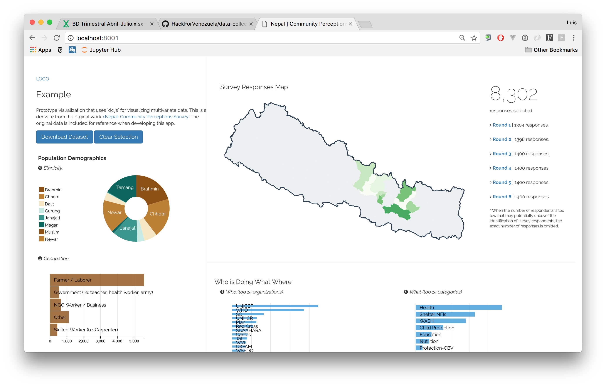

## Sample Visualization



This is a sample visualization of a multi-variate dataset. The visualization uses `dc.js` to render a number of charts that are all linked to each other.

### Usage
For development, run an HTTP server locally. Here are a few examples unsing `npm` or `python`:

```
# Using Python 3
$ python3 -m http.server

# Using NPM (you'll need to install this first)
$ http-server
```

I've also added a Docker container for making this easier to deploy. See the [`Dockerfile`](/Dockerfile) for details. 

### Running docker    
```bash   
git clone 
git checkout visualization

# build docker  
docker build -t miconvive .  

# run docker 
docker run -p 8000:3000 -t miconvive
```

### Architecture
This visualization is a static page that can be rendered by any modern browser. It uses JavaScript (ES5) create all the charts on the browser, not requiring any backend work. This means that this page can be served from any statis web-server, including [GitHub Pages](https://pages.github.com/) (which is free).

The prosed architecture contains the following elements:

* application is hosted on GibHub pages
* GitHub repository contains the GeoJSON data
* the app queries the AirTable endpoint for collecting the table data
* the app renders the visualization

This will make any changes made to the data be reflected in real-time on the visualization (cosider the existence of browser-based caching and GitHub caching, though). That makes the whole architecture quite simple.

### GitHub Pages
GitHub pages can be used to host this kind of files and having them available directly as a repostiory. One of its features is to have a specific domain name attached to it. For more information, check its documentation at [GitHub Pages](https://pages.github.com/).

### License
This project is a derivate from this [repository](https://github.com/luiscape/hdxviz-nepal-community-survey). It is licensed under the MIT License, which is also included here.
